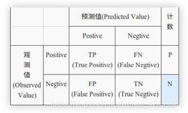

# PyWeb

#### 介绍

python的web项目实例

基于协同过滤的图书推荐系统

####功能模块

1.会员登陆与注册：未注册用户能够登陆系统查看主页，只有注册用户才能够接受推荐和购买并评价图书

2.主页展示：用户再完成登陆后首先进入首页展示的是新书,以及各种书籍排行榜以及作者极其图书

3.图书详情：用户再购买图书时展示图书详情并能够查看其它用户对此书籍的评价

4.推荐模块：基于协同过滤，能够对不同的用户进行不同的个性化推荐

6.修改密码：用户能够通过手机号验证或者邮箱验证的情况下修改密码

7.书籍管理：后台能够对书籍实现增删改查，设置商品的属性


#### 安装教程

1. 运行Django中创建数据库的代码。

```
python manage.py makemigrations

python manage.py migrate    
```        

2. 更改Spider_douban和Spider_comment中的数据库密码，以及recommend中的数据库密码
   
   运行两个爬虫程序获取书籍数据。


3. 运行Django项目即可运行。


#### 记录

##### 4.20

django链接数据库报错，此前未连接数据库的时候能够正常运行，连接mysql数据库的时候编码会出错，根据报错的提示将decode和encode两者互相更改就行

##### 4.21

数据库连接报错的原因是数据库版本过低，升级版本即可

进行爬取数据时会遇到各种无法搜索到的情况

##### 4.22

```python manage.py runserver``` 启动项目

```python manage.py startapp app名``` 创建app

##### 4.23


```
python manage.py makemigrations

python manage.py migrate    
```           

创建数据库需要在cmd中执行的命令

数据库中已经创建成功的表

```python manage.py inspectdb```
使用以上代码获取

```User.objects.creat()```  往数据库表中添加数据

```User.objects.filter(id=3).delete()```   从数据库中删除数据

从数据库中获取到的数据格式为Queryset数据[对象，对象，对象]

如果想要获取的数据为单条数据，则可以使用以下代码：

```
row = User.objects.filter(in=1).first()

print(row.id,row.name)
```

更新数据

```
User.objects.filter(id=1).update(name=hariki)
```

##### 4.24

'NoneType'object has no attribute 'upsw' 当读取不到用户的时候也就无法获取到upsw就会报错

所以此处使用重载的password返回一个AttributeError
```
    def verify_password(self, password):
        return check_password_hash(self.password, password) 
```

实现了登陆注册页面开始了个人详情页面

主页仍然是只做了头部，没有做页面渲染


##### 4.26

 ``` python manage.py createsuperuser```

实现了图书详情页面和主页，把admin页面也开启了，由于django项目自带admin后台页面所以也就不需要考虑后台，只需要根据提示创建超级用户即可，爬取了豆瓣读书的评论并存入数据库，并将其展示在了书籍详情页面

手机号验证可以考虑加一个发送验证码按钮，如果用户有邮箱就发邮箱，存入了手机号就发手机号


##### 4.27

完善了到书单和结算界面的跳转，并且能够展示评论

##### 4.28

已经实现了对图书的评论，完善主页展示各个tag最热图书，以及展示新书和作者

##### 4.29

评分预测： 均方根误差(RMSE):√∑(r-R)²/|t|    r为用户u对物品i的评分，R为推荐算法计算得到的评分
         平均绝对值误差(MAE)：∑(r-R)/|t|    

RMSE由于存在平方项，使得使得用户真实评分与推荐系统预测评分相差较大的用户加大了惩罚，即该评测指标对系统要求更加的苛刻。

精确率(precision):∑|R(u)∩T(u)|/∑|T(U)| 分类正确的正样本个数占分类器判定为正样本的样本个数比例(这里R(u)相当于是模型判定的正样本)

召回率(recall): ∑|R(u)∩T(u)|/∑|T(U)|分类正确的正样本个数占真正的正样本个数的比例(这里的T(u)相当于真正的正样本集合)

T(u)和R(u)代表的意义不同

新颖性，就是为用户推荐那些他们之前从未听说过的商品。通过在推荐列表中过滤掉之前用户浏览过或购买过的商品，即可以最简单的方式实现推荐的新颖性。或将推荐列表中热门度较高的商品进行过滤，因为越不热门的商品，往往对于用户来说是越新颖的。但是这种方法依然不够严谨，若想要获得更准确的信息，还需要进行用户调查。

混淆矩阵：


 True Positive（TP）：真正类。样本的真实类别是正类，并且模型识别的结果也是正类。

 False Negative（FN）：假负类。样本的真实类别是正类，但是模型将其识别为负类。

 False Positive（FP）：假正类。样本的真实类别是负类，但是模型将其识别为正类。

 True Negative（TN）：真负类。样本的真实类别是负类，并且模型将其识别为负类。


召回层：待计算的候选集合大、计算速度快、模型简单、特征较少，尽量让用户感兴趣的物品在这个阶段能够被快速召回，即保证相关物品的召回率

排序层：首要目标是得到精准的排序结果。需要处理的物品数量少，可以利用较多的特征，使用比较复杂的模型。

```pychon
from sklearn.metrics.pairwise import cosine_similarity
a = [1,0,0,0]
b = [1,0.5,0.5,0]
c = cosine_similarity([a,b])
```
cosine_similarity计算


```pychon
sort_values(by, axis=0, ascending=True, inplace=False, kind=‘quicksort’, na_position=‘last’)
```

①axis 如果axis=0，那么by=“列名”； 如果axis=1，那么by=“行名”；

②ascending: True则升序，可以是[True,False]，即第一字段升序，第二个降序

③inplace: 是否用排序后的数据框替换现有的数据框 ，True,或者False

④kind: 排序方法

⑤na_position : {‘first’, ‘last’}, default ‘last’，默认缺失值排在最后面


defer
把不需要展示的字段做延迟加载。比如说，需要获取到文章中除正文外的其他字段，就可以通过posts = Post.objects.all() .defer('content'),这样拿到的记录中就不会包含content部分。但是当我们需要用到这个字段时，在使用时会去加载。代码:

```python
posts = Post.objects.all().defer('content')
for post in posts:  #此时会执行数据库查询
   print (post.content)  #此时会执行数据查询，获取到content
   
```

当不想加载某个过大的字段时(如text类型的字段)，会使用defer,但是上面的演示代产生N+1的查询问题，在实际使用时千万要注意!

注意：上面的代码是个不太典型的 N+1查询的问题， 一般情况下 由外键查询产生的N+1问题比较多，即一条查询请求返回N条数据，当我们操作数据时，又会产生额外的请求。这就是N+1问题，所有的ORM框架都存在这样的问题。


##### 4.30

实现了搜索功能以及，数据分页功能